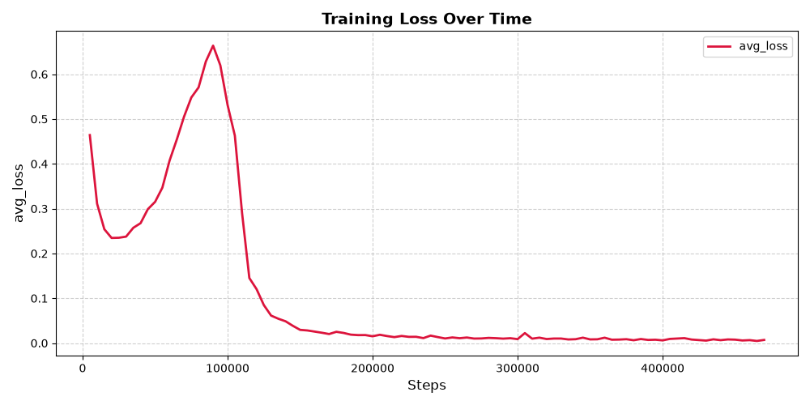

# Tic-Tac-Toe Neural Network (NumPy, From Scratch)

A neural network built from scratch using only NumPy — no PyTorch, no TensorFlow —
that learns to play tic-tac-toe through REINFORCE policy gradients. The trained
agent plays **optimally as first player (X)**: it draws against a perfect minimax
opponent and never loses a single game in any test.

## Results

| Opponent | Games | Wins | Draws | Losses |
|:---|:---:|:---:|:---:|:---:|
| Perfect minimax (deterministic) | 5 | 0 | 5 | **0** |
| Random play | 1000 | 996 | 4 | **0** |
| Random opening + perfect play | 1000 | 884 | 116 | **0** |

In tic-tac-toe, perfect play from both sides always ends in a draw. Drawing
against minimax proves the agent plays optimally — a policy that never loses
against perfect play cannot be improved.

## How it works

### Network (`network.py`)
- Fully connected feedforward network, built from scratch in NumPy.
- Arbitrary depth — input size, hidden layers, and output size are constructor args.
- Leaky ReLU activation (slope 0.1) in both forward and backward pass, implemented
  independently to solve dying-neuron problems encountered during early training.
- Softmax output over the 9 board cells.
- REINFORCE policy gradient update.
- **Soft weight pruning**: small-magnitude weights are periodically zeroed during
  training to test whether the policy survives with a sparser network.

### Training (`train.py`)
- Self-play against a curriculum opponent that starts nearly random and gradually
  learns to block and take immediate wins.
- Learning rate decays linearly from 5e-4 to 5e-5 over the first 1M games.
- Best model checkpointed based on periodic minimax evaluation.
- Metrics logged every 5,000 games.

### Evaluation (`evaluate.py`)
- Deterministic argmax policy.
- Two tests: vs. random, vs. pure minimax.

## Training curve



The curve tells a curriculum-learning story: an initial dip as the agent learns
basic legal play, a spike as the opponent grows stronger, then a sharp drop as the
agent adapts, followed by convergence near zero. The y-axis is the mean magnitude
of the policy-gradient signal — REINFORCE does not have a supervised loss, so this
measures update magnitude, not classification error.

## Files

| File | Purpose |
|:---|:---|
| `network.py` | Neural network from scratch (forward, REINFORCE update, pruning, save/load) |
| `tictactoe.py` | Environment and perfect minimax opponent |
| `train.py` | Training loop with curriculum opponent and logging |
| `evaluate.py` | Evaluation against random and minimax |
| `logger.py` | `TrainingLog` for metrics + `Visualizer` for live plotting |
| `plot.py` | Regenerates the training curve from `training_log.npz` |
| `training_curve.png` | Training curve |

## Setup

```bash
pip install numpy matplotlib
```
A pretrained model (tictactoe_model.npz) is included in the repository. To
evaluate it directly without training, run python evaluate.py. To train a new
model from scratch, run python train.py first.
## Usage

Train from scratch:
```bash
python train.py
```

Evaluate a trained model:
```bash
python evaluate.py
```

## Notes and limitations

- The state encoding uses 9 inputs, relative to the current player's perspective.
  Because the agent was trained only as first player, the trained policy is
  specific to playing as X.
- Evaluation uses the raw argmax of the network's output; illegal moves are not
  masked. In 2,005 games across all three tests, the agent never forfeited,
  indicating the policy learned to avoid occupied cells.
