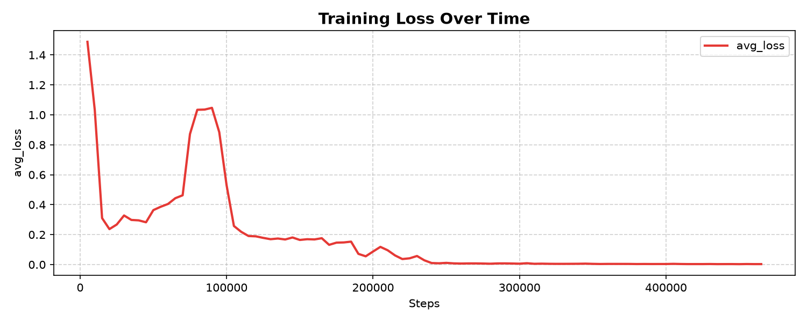
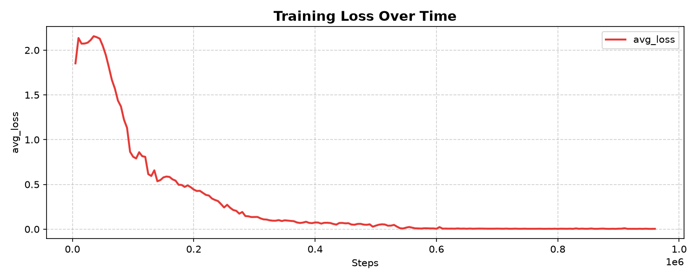

# Tic-Tac-Toe Neural Networks (NumPy, From Scratch)

Two neural networks built from scratch using only NumPy — no PyTorch, no
TensorFlow — that learn to play tic-tac-toe through REINFORCE policy gradients.
Both agents play optimally: each draws against a perfect minimax opponent as its
respective side, and neither loses a single game in any test.

## Results

Both agents share the same architecture (9 → 88 → 9) and training procedure. The
only difference is `agent_side` (1 for X, -1 for O).

### X-agent (first player)

| Opponent | Games | Wins | Draws | Losses |
|:---|:---:|:---:|:---:|:---:|
| Perfect minimax | 1 | 0 | 1 | **0** |
| Random play | 1000 | 994 | 6 | **0** |
| Random opening + perfect play | 1000 | 881 | 119 | **0** |
| O-agent | 1000 | 0 | 1000 | **0** |

### O-agent (second player)

| Opponent | Games | Wins | Draws | Losses |
|:---|:---:|:---:|:---:|:---:|
| Perfect minimax | 1 | 0 | 1 | **0** |
| Random play | 1000 | 780 | 220 | **0** |
| Random opening + perfect play | 1000 | 0 | 1000 | **0** |
| X-agent | 1000 | 0 | 1000 | **0** |

In tic-tac-toe, perfect play from both sides always ends in a draw. An agent
that draws against minimax is playing optimally — its policy cannot be improved.
That both agents independently reach this state, and draw against each other
1000/1000, is strong evidence they have both converged to optimal play.

## How it works

### Network (`network.py`)
- Fully connected feedforward network, built from scratch in NumPy.
- Arbitrary depth — input size, hidden layers, and output size are constructor args.
- Leaky ReLU activation (slope 0.1) in both forward and backward pass, implemented
  independently to solve dying-neuron problems encountered during early training.
- Softmax output over the 9 board cells.
- REINFORCE policy gradient update.
- **Soft weight pruning**: small-magnitude weights are periodically zeroed during
  training to test whether the policy survives with a sparser network.

### Training (`train.py`)
- Self-play against a curriculum opponent that starts nearly random and gradually
  learns to block and take immediate wins.
- `agent_side = 1` trains the X-agent; `agent_side = -1` trains the O-agent.
- Learning rate decays linearly from 5e-4 to 5e-5 over the first 1M games.
- Best model checkpointed based on periodic minimax evaluation.
- Metrics logged every 5,000 games.

### Evaluation (`evaluate.py`)
- Deterministic argmax policy.
- Tests: vs. random, vs. random-opening + perfect play, vs. pure minimax.

## Training curves

**X-agent (first player):**



**O-agent (second player):**



Both curves show the same curriculum-learning story: an initial dip as the
agent learns basic legal play, a spike as the opponent grows stronger, then
a sharp drop as the agent adapts, followed by convergence near zero. The
y-axis is the mean magnitude of the policy-gradient signal — REINFORCE does
not have a supervised loss, so this measures update magnitude, not
classification error.

## Files

| File | Purpose |
|:---|:---|
| `network.py` | Neural network from scratch (forward, REINFORCE update, pruning, save/load) |
| `tictactoe.py` | Environment and perfect minimax opponent |
| `train.py` | Training loop with curriculum opponent and logging |
| `evaluate.py` | Evaluation against random and minimax |
| `logger.py` | `TrainingLog` for metrics + `Visualizer` for live plotting |
| `plot.py` | Regenerates the training curve from a training log |
| `tictactoe_model_x.npz` | Trained X-agent weights |
| `tictactoe_model_o.npz` | Trained O-agent weights |
| `training_curve_x.png` | X-agent training curve |
| `training_curve_o.png` | O-agent training curve |

## Setup

```bash
pip install numpy matplotlib
```

Pretrained models (`tictactoe_model_x.npz` and `tictactoe_model_o.npz`) are
included. To evaluate them without training, run `python evaluate.py`. To train
a new model from scratch, run `python train.py` with the desired `agent_side`.

## Usage

Train from scratch:
```bash
python train.py
```

Evaluate a trained model:
```bash
python evaluate.py
```

## Notes and limitations

- The state encoding uses 9 inputs, relative to the current player's perspective.
  Because the perspective flips with the current player, the same architecture
  works for both sides.
- Evaluation uses the raw argmax of the network's output; illegal moves are not
  masked. Across 6,000+ evaluation games, neither agent ever forfeited, indicating
  both policies learned to avoid occupied cells.
- The O-agent draws (rather than wins) against opponents that open randomly and
  then play perfectly. This is consistent with optimal play — verified separately:
  even a perfect minimax opponent as O draws 500/500 against this setup.

## License

MIT — see [LICENSE](LICENSE) for details.
